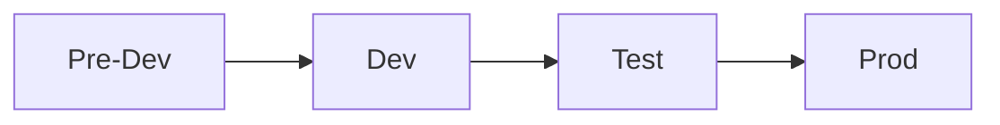

# Initial Pipeline

This chapter will help you to configure a simple path to production pipeline in Terraform Cloud. The pipeline will deploy the following environments:

By the end of this chapter you will have:

* A GitHub repository containing Terraform code to manage an AWS VPC and some subnets.
* A Terraform Cloud project and several workspaces linked to the above GitHub repository; each workspace will control each of the above path to production stages
* OIDC authentication configured so that Terraform Cloud uses temporary credentials for interacting with AWS APIs
